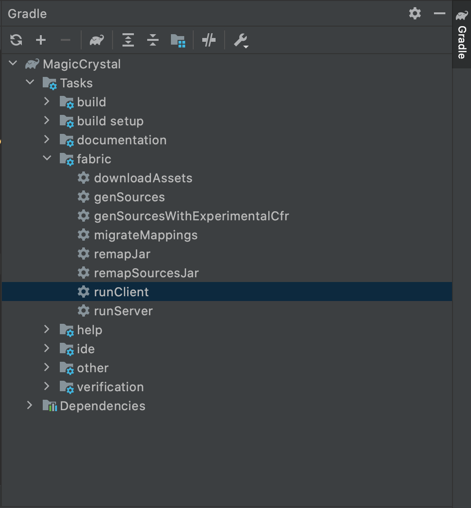

# How to setup a development environment

## Intellj IDEA (Recommend)

Note: It is not necessary to buy the Ultimate version of this IDE,
for developing this mod, Community version is enough.

### Prerequisites

Please make sure you have installed the following software:

- [JDK 16](https://adoptopenjdk.net/releases.html)
- [Gradle](https://gradle.org/install/)

### IDEA plugins

- [Minecraft Development](https://plugins.jetbrains.com/plugin/index?xmlId=com.demonwav.minecraft-dev)
- [Kotlin](https://plugins.jetbrains.com/plugin/6954-kotlin)

### Run

Just open the project with the IDE, wait a few minutes, and use the Gradle panel.

Normally `Tasks/fabric/runClient` is all you want, 
just click it, and a Minecraft instance will run with this mod installed.

## VSCode

### Prerequisites

Please make sure you have installed the following software:

- [JDK 16](https://adoptopenjdk.net/releases.html)
- [Gradle](https://gradle.org/install/)

Normally you can install them via your system package manager.

### VSCode Plugins

- [Gradle Tasks](https://marketplace.visualstudio.com/items?itemName=richardwillis.vscode-gradle)
- [Kotlin](https://marketplace.visualstudio.com/items?itemName=mathiasfrohlich.Kotlin)

### Run

Just use the Command Palette to run gradle tasks, just like any other gradle projects.
